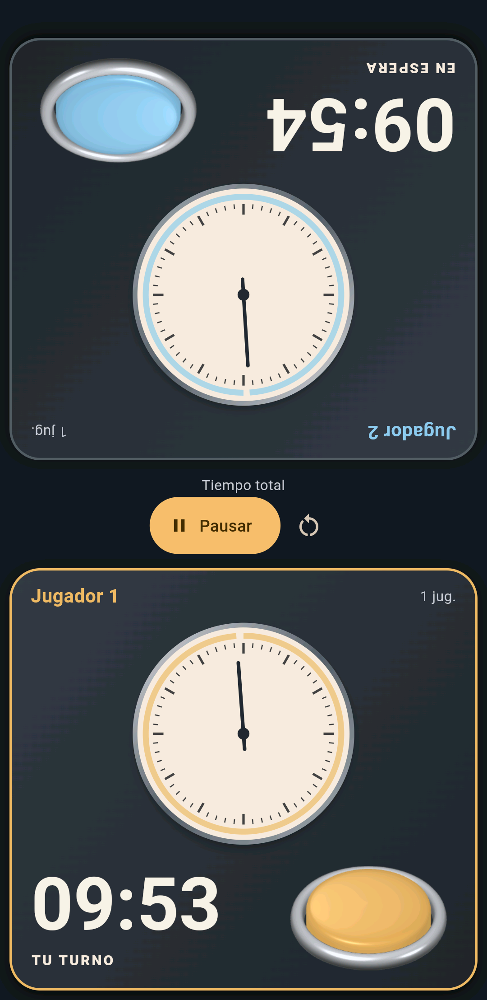
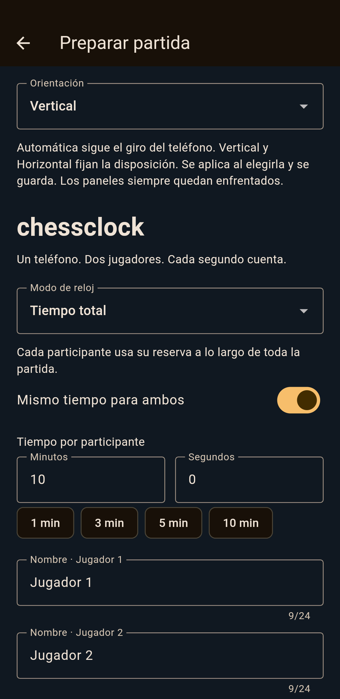
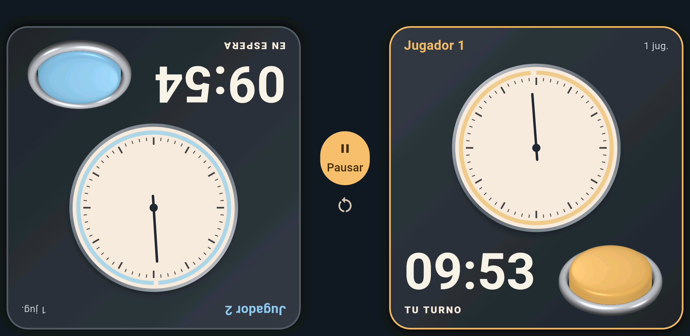

#  chessclock

Reloj de ajedrez Android para dos participantes, implementado en Flutter y Kotlin. El proyecto está directamente en esta raíz; no requiere una subcarpeta adicional.

**Versión:** 1.4.0+6 · **Android mínimo:** 7.0 (API 24) · **Funcionamiento:** completamente sin conexión.

## 📱 Vista de la aplicación

| Relojes en vertical | Configuración |
| :---: | :---: |
|  |  |

## 📥 Instalar

Generá el APK siguiendo la [guía de compilación](docs/BUILD.md). El archivo firmado está en [`dist/chessclock-1.4.0.apk`](dist/chessclock-1.4.0.apk), junto con su checksum SHA-256 y los metadatos de verificación. La carpeta `dist` se incluye en Git y conserva únicamente la última versión generada y verificada. Cada compilación exitosa elimina las entregas anteriores de esa carpeta.

## ⏱️ Funciones

- Tres modos: límite por jugada, reserva total y cronómetro por jugada.
- Tiempos independientes, nombres, primer participante y preferencias persistentes.
- Orientación automática por sensor o manual (vertical/horizontal), guardada entre aperturas.
- Paneles enfrentados, esferas grandes y pulsadores lisos encastrados en un aro metálico, con presión animada, clic MP3 y protección contra contactos simultáneos.
- Pausa exacta, pausa por interrupción, audio aleatorio de fin de partida (uno de cinco), vibración configurable y recuperación explícita del último estado guardado.
- Sin cuentas, publicidad, red, servicios externos ni paquetes de terceros agregados para ejecución.

## 📚 Documentación y validación

Los sonidos están en [`assets/audio/`](assets/audio/). El clic actual es `move_click.mp3` y los finales de partida son `endgame_1.mp3` a `endgame_5.mp3`. Agregar archivos no cambia automáticamente la selección. El clic se selecciona en `MainActivity.kt` y los finales de partida se enumeran en `lib/platform/android_services.dart`. El generador `scripts/Generate-MoveClick.py` recrea únicamente el WAV original; no genera ni reemplaza el MP3 actual.

- [Uso e instalación](docs/USO.md).
- [Entorno, arquitectura, compilación y firma](docs/BUILD.md).
- [Validación de la versión inicial](docs/VALIDACION.md).

La versión 1.4.0 pasó el análisis estático, 47 pruebas unitarias/widgets y el flujo visual en Android API 24. Se verificaron el APK firmado y sus recursos incluidos. Las capturas corresponden a esa ejecución; la percepción de sonido/vibración y las latencias en teléfono físico quedan pendientes. Las validaciones anteriores se detallan en la guía de compilación.

Para compilar, usar Flutter 3.41.9 y la combinación de herramientas documentada. Ejecutar `flutter analyze`, `flutter test` y `./scripts/Build-Release.ps1`. La firma privada está excluida del repositorio y de `dist`; conservarla para actualizaciones.
